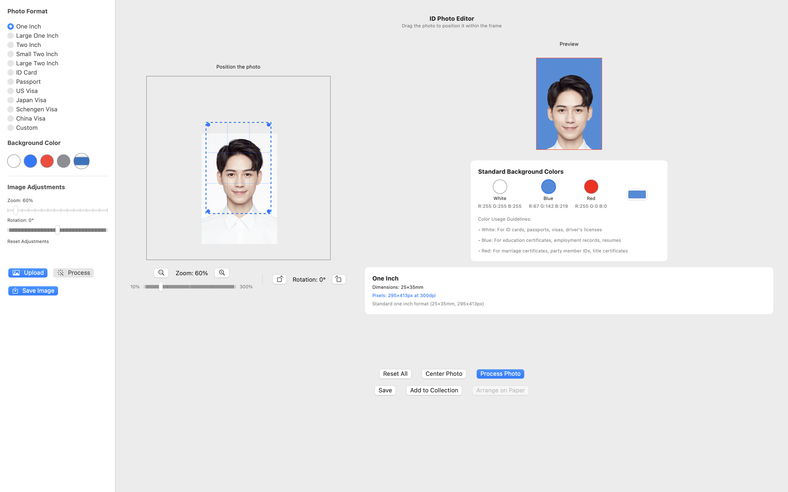
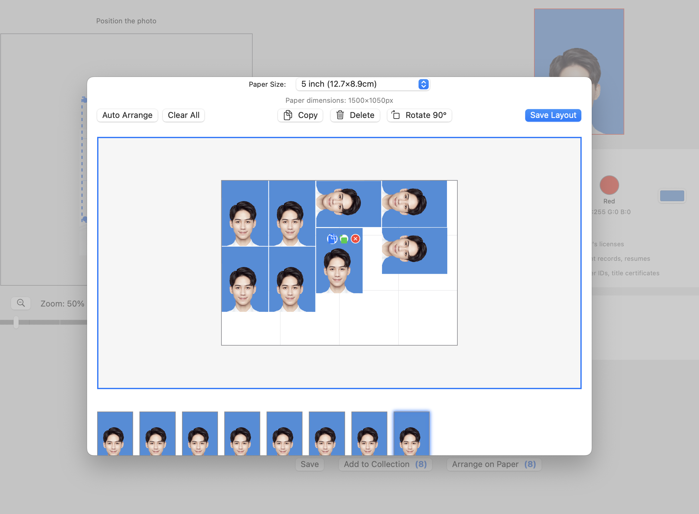

# ID Photo Helper

  

## Overview
ID Photo Helper is a native macOS application designed to simplify the creation of professional-quality ID, passport, and visa photos. The app helps you transform ordinary photos into standardized identification pictures that meet specific dimensional requirements for various documents.

## Features

### Photo Editing
- **Background Removal**: Automatically detects the person in your photo and replaces the background with a solid color
- **Customizable Background Colors**: Choose from standard colors (white, blue, red) or select your own custom color
- **Intuitive Positioning**: Easily drag, zoom, and rotate your photo to perfectly fit within the required frame

  

### Comprehensive Format Support
- **Multiple Standard Sizes**: Includes formats for passports, visas, ID cards, and other common photo identification requirements
- **Custom Dimensions**: Create photos with your own specified dimensions when standard formats don't meet your needs
- **Real-time Preview**: See exactly how your final photo will look during editing

### Photo Collection & Arrangement
- **Save Multiple Photos**: Build a collection of processed photos for different purposes
- **Auto-Arrange on Paper**: Intelligently organize multiple photos on standard photo paper sizes
- **Multiple Paper Sizes**: Support for different photo paper dimensions (3-inch, 4-inch, 5-inch, 6-inch)

  

### Export Options
- **Individual Photo Export**: Save single photos in high resolution (300 DPI)
- **Photo Paper Layout**: Arrange multiple photos on a sheet and save as a single image ready for printing
- **High Quality Output**: All exports are print-ready with exact pixel dimensions

## Supported Photo Formats

The app includes templates for numerous standard photo formats:

- Passport (33×48mm)
- US Visa (51×51mm)
- Japan Visa (45×45mm)
- Schengen Visa (35×45mm)
- China Visa (33×48mm)
- ID Card (26×32mm)
- One Inch (25×35mm)
- Large One Inch (33×48mm)
- Two Inch (35×49mm)
- Small Two Inch (35×45mm)
- Large Two Inch (35×53mm)
- Custom sizes (user-defined)

## How to Use

### Basic Photo Processing

1. Launch ID Photo Helper
2. Click "File > Open" to select and load your photo
3. Choose the required photo format from the dropdown menu
4. Position your subject by dragging the photo within the blue frame
5. Adjust zoom level and rotation as needed
6. Select your desired background color
7. Click "Process Photo" to generate your ID photo
8. Click "Save" to export the final image

### Creating Photo Collections

1. Process each photo as described above
2. Click "Add to Collection" after processing each photo
3. To view and arrange your collection, click "Arrange on Paper"
4. In the layout view, you can:
   - Select a paper size from the dropdown menu
   - Drag photos to reposition them
   - Click "Auto Arrange" for optimal positioning
   - Duplicate, rotate, or delete individual photos
5. Click "Save Layout" to export the entire arrangement as a single image

## System Requirements

- macOS 10.15 (Catalina) or later
- 4GB RAM minimum (8GB recommended for larger photos)
- 100MB free disk space for installation

## Performance Tips

- For optimal performance when dragging, zooming or rotating photos, the app uses debouncing to ensure smooth operation
- Processing of large images is automatically optimized to maintain responsiveness
- Use the Auto Arrange feature for efficient layout of multiple photos

## Sample Photo

Below is an example photo that works well with ID Photo Helper:

  

## Tips for Perfect ID Photos

- Use a well-lit photo with even lighting on the face
- Choose a plain background for the original photo when possible
- Position the subject to follow standard ID photo conventions (centered, proper head size)
- For best results, use photos where the subject is clearly separated from the background

---

*ID Photo Helper is designed to help you create photos that meet common requirements, but please check the specific requirements of the issuing authority for your particular document, as these may change over time.* 